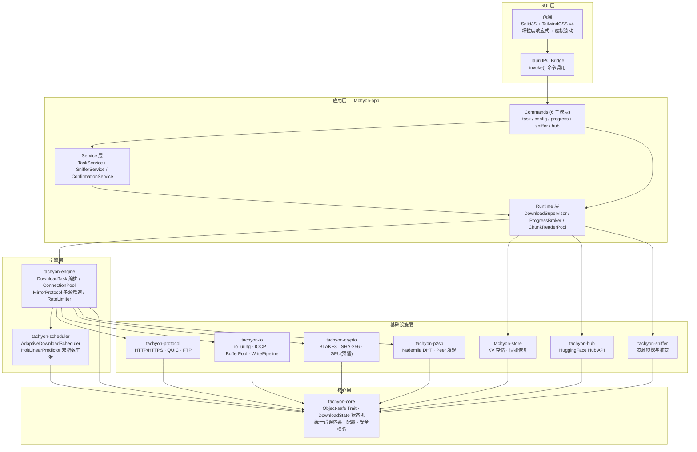
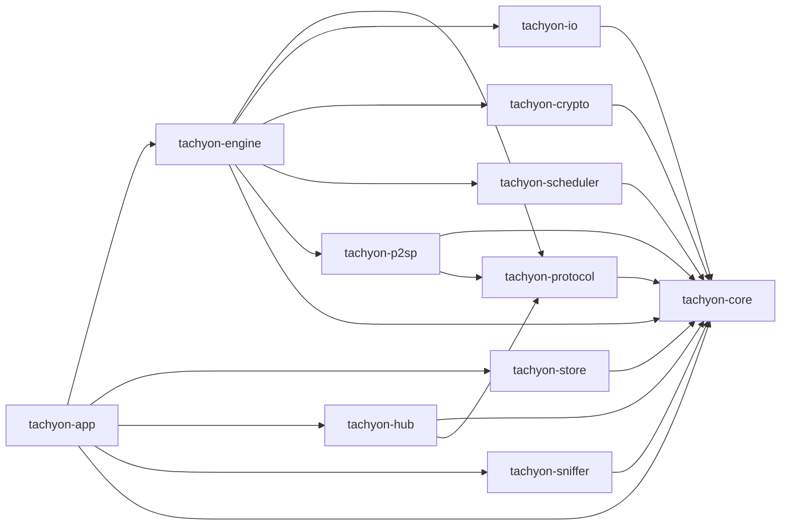
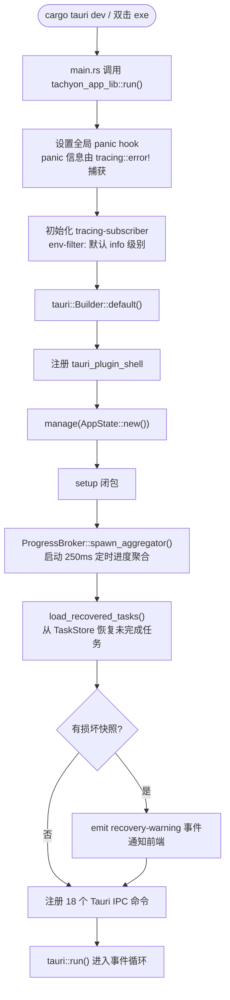
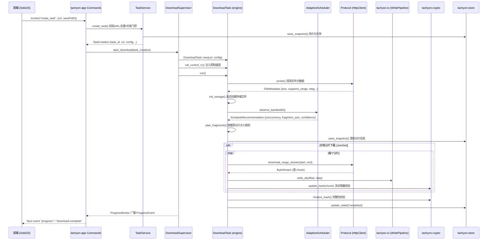
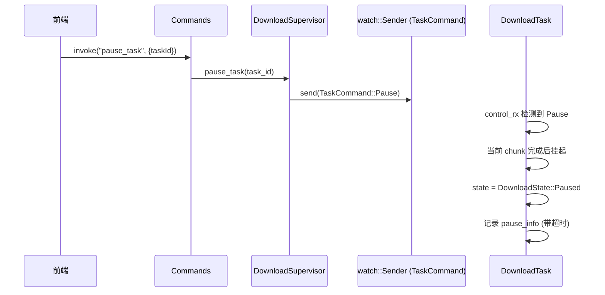
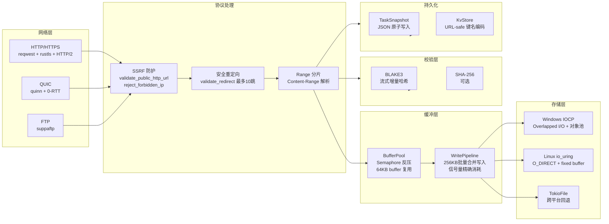
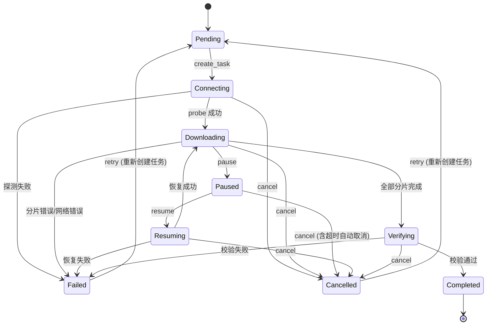

<h1 align="center">Tachyon</h1>

<p align="center">
  <strong>基于 Rust + Tauri v2 构建的高性能桌面下载器</strong>
</p>

<p align="center">
  <a href="https://github.com/baiye2941/Tachyon/actions/workflows/ci.yml"></a>
  
  
  
  
  <a href="LICENSE"></a>
  
</p>

---

## 1. 项目概述

Tachyon 是一款使用 Rust 语言构建的桌面端高性能文件下载器，以 Tauri v2 为 GUI 框架、SolidJS 为前端渲染引擎。项目以 Cargo workspace 组织 11 个 crate，覆盖从网络协议到磁盘 I/O 的完整下载链路。

**解决的问题**

- 大文件单线程下载带宽利用率低、断线后需从头重下
- 现有下载工具缺乏 HuggingFace 模型仓库的原生集成
- 桌面端缺少一款在 I/O 路径上做到零拷贝、GPU 加速校验的极致性能工具

**核心能力（均基于代码实际）**

| 能力 | 说明 |
|:--|:--|
| 多线程分片下载 | 基于 `DownloadTask` 的动态分片规划，调度器推荐分片大小，`JoinSet` 并发执行 |
| HTTP/HTTPS 全流式下载 | `HttpClient` 实现 `Protocol` trait，支持 `download_range_stream` 逐 chunk 流式传输 |
| QUIC 传输 | `QuicTransport` 基于 quinn + rustls，支持 0-RTT session resumption（`quic` feature） |
| FTP 协议 | `FtpClient` 基于 suppaftp，支持真流式 64KB chunk 读取（`ftp` feature） |
| 多源竞速下载 | `MirrorProtocol` Happy Eyeballs 风格多源并行 probe，主源失败自动 fallback |
| 零拷贝存储引擎 | Linux io_uring（O_DIRECT + fixed buffer）、Windows IOCP（NO_BUFFERING）、跨平台 TokioFile 自动回退 |
| 智能调度与带宽预测 | `AdaptiveDownloadScheduler` + `HoltLinearPredictor` 双指数平滑，动态调整并发度和分片大小 |
| 流式哈希校验 | `CpuVerifier` 支持 BLAKE3/SHA-256，常量时间比较防时序侧信道 |
| 断点续传 | `RecoveryManager` 任务快照持久化，支持分片级和字节级续传 |
| HuggingFace Hub 集成 | `HubApi` 支持文件列表浏览、LFS 解析、Token 管理 |
| 浏览器资源嗅探 | `tachyon-sniffer` 基于文件扩展名识别视频/音频/文档/压缩包等资源类型 |
| P2SP 混合下载 | `KademliaDht` 分布式哈希表 + `SourceSelector` 多源选择（框架就绪） |
| 限速控制 | `RateLimiter` 无锁令牌桶，支持跨任务全局限速 |
| 协议 Feature Flag 裁剪 | 默认启用 ftp+quic，`--no-default-features` 仅构建 HTTP，减小二进制体积 |

---

## 2. 技术栈

**前端**

| 技术 | 版本 | 用途 |
|:--|:--|:--|
| SolidJS | ^1.9 | 细粒度响应式 UI 框架 |
| Tauri API | ^2.11 | 前端-后端 IPC 桥接 |
| TailwindCSS | ^4.3 | 原子化 CSS 框架 |
| Vite | ^7.3 | 构建工具 |
| Bun | 1.x | 包管理与脚本运行 |
| Vitest | ^3.2 | 单元测试 |
| Playwright | ^1.61 | E2E 测试 |
| Storybook | 10.4 | 组件开发与文档 |
| @motionone/solid | ^10.16 | 动画库 |
| solid-i18n | ^1.1 | 国际化（中/英） |

**后端（Rust workspace 11 crate）**

| 领域 | Crate | 关键依赖 |
|:--|:--|:--|
| 核心抽象 | `tachyon-core` | serde, thiserror, uuid, strum, tokio |
| 下载引擎 | `tachyon-engine` | tachyon-core/io/protocol/crypto/scheduler, dashmap, blake3 |
| 智能调度 | `tachyon-scheduler` | tachyon-core, parking_lot |
| 异步 I/O | `tachyon-io` | crossbeam-queue, parking_lot; Linux: io-uring; Windows: windows-sys |
| 网络协议 | `tachyon-protocol` | reqwest (rustls+HTTP/2), quinn (QUIC), suppaftp (FTP) |
| 哈希校验 | `tachyon-crypto` | blake3, sha2; wgpu (可选, GPU 加速) |
| 资源嗅探 | `tachyon-sniffer` | url |
| P2SP 网络 | `tachyon-p2sp` | ed25519-dalek, postcard, getrandom, blake3 |
| 持久化存储 | `tachyon-store` | serde_json, fs2 |
| Hub 集成 | `tachyon-hub` | tachyon-protocol (HTTP) |
| Tauri 应用 | `tachyon-app` | tauri v2, tauri-plugin-shell, chrono, dashmap, tracing-subscriber |

**关键第三方依赖（workspace 级）**

| 依赖 | 用途 |
|:--|:--|
| tokio (full) | 异步运行时，多线程调度 |
| reqwest (rustls) | HTTP 客户端，HTTP/2 支持 |
| quinn + rustls | QUIC 传输层 |
| blake3 | 高性能哈希 |
| serde + serde_json | 序列化/反序列化 |
| thiserror | 错误类型派生 |
| strum | 枚举 Display/FromStr 派生 |
| tracing | 结构化日志 |
| dashmap | 并发安全 HashMap |
| parking_lot | 轻量级同步原语 |
| postcard | 紧凑二进制序列化 (DHT 消息) |
| wgpu | GPU 计算抽象（实验性） |
| criterion | 统计学基准测试 |
| proptest | 属性测试 |

---

## 3. 系统架构

### 3.1 整体分层架构

依赖方向单向无环：`core -> {protocol, io, crypto, scheduler} -> engine -> app`，其余 crate（p2sp, sniffer, store, hub）按各自 Cargo.toml 依赖执行，禁止跨层绕行。



### 3.2 tachyon-app 内部三层架构

tachyon-app 内部采用 Commands / Service / Runtime 三层分离，将 Tauri IPC 适配、业务逻辑和运行时生命周期解耦。

```text
+--------------------------------------------------+
|  Tauri Commands (适配层)                           |
|  参数解析 · 错误序列化 · IPC 桥接                    |
|  6 子模块: task / config / progress / sniffer / hub |
+--------------------------------------------------+
|  Service 层 (业务逻辑)                              |
|  TaskService: 创建/暂停/恢复/取消 · 并发门控 · 去重   |
|  SnifferService: 嗅探资源管理                       |
|  ConfirmationService: 破坏性操作二次确认 token       |
+--------------------------------------------------+
|  Runtime 层 (运行时管理)                            |
|  DownloadSupervisor: 任务 spawn · 进度收集 · 资源清理 |
|  ProgressBroker: 250ms 定时扫描 · O(1) 事件广播     |
|  ChunkReaderPool: 共享 chunk reader 工作池          |
+--------------------------------------------------+
```

**AppState** 由四个独立状态组聚合：

| 状态组 | 字段 | 职责 |
|:--|:--|:--|
| `DomainState` | `TaskRepository`, `AppConfig` | 领域数据 |
| `InfraState` | `ConnectionPool`, `TaskStore`, `ChunkReaderPool` | 基础设施 |
| `ServiceState` | `TaskService`, `SnifferService`, `ConfirmationService` | 业务服务 |
| `RuntimeState` | `DownloadSupervisor`, `ProgressBroker`, `progress_subscribed` | 运行时 |

### 3.3 Crate 依赖关系



---

## 4. 执行流程

### 4.1 启动流程



### 4.2 下载任务核心流程



### 4.3 控制命令流程（暂停/恢复/取消）



---

## 5. 数据流设计

### 5.1 网络到磁盘数据流



### 5.2 下载任务状态机



`DownloadState::try_transition()` 强制执行合法状态转换，非法转换返回 `DownloadError::Config`。`PauseInfo` 跟踪暂停时长，超时自动触发取消。

### 5.3 ProgressBroker 事件聚合

`ProgressBroker` 以单一 250ms 定时器扫描所有活跃任务，合并为单个 `ProgressEvent` (HashMap) 广播：

```text
活跃任务 100 个时:
  旧方案 (每任务独立 500ms monitor): ~200 events/s
  ProgressBroker (单一定时器):    4 events/s
  降低约 98% 的 IPC / JSON 序列化 / 前端 store 更新开销
```

---

## 6. 核心模块详解

### 6.1 tachyon-core — 核心抽象层

**位置**: `crates/tachyon-core/src/`

**职责**: 定义所有 crate 共享的类型、trait 抽象、错误体系、配置与安全校验。

**关键结构体与枚举**:

| 符号 | 位置 | 说明 |
|:--|:--|:--|
| `DownloadState` | `types.rs` | 9 状态枚举 (Pending/Connecting/Downloading/Paused/Resuming/Verifying/Completed/Failed/Cancelled)，含 `try_transition()` 状态机守卫 |
| `TaskCommand` | `types.rs` | 控制命令枚举 (Start/Pause/Resume/Cancel)，与 DownloadState 解耦 |
| `PauseInfo` | `types.rs` | 暂停超时跟踪，含 `is_expired()` 检测 |
| `FragmentInfo` | `types.rs` | 分片信息 (index/start/end/size/downloaded/hash)，含不变量校验 |
| `FileMetadata` | `types.rs` | 远程文件元数据 (file_name/file_size/content_type/supports_range/etag) |
| `FragmentProgress` | `types.rs` | 分片进度回调消息 (fragment_index/completed/fragment_downloaded) |
| `TaskProgress` | `types.rs` | 任务进度聚合 (downloaded/speed/progress/fragments_done) |
| `DownloadError` | `error.rs` | 统一错误类型，含 17 个变体 (Network/Protocol/Io/ChecksumMismatch/Cancelled/Throttled/Forbidden 等) |
| `DownloadConfig` | `config.rs` | 下载配置，含下载目录/并发数/重试/超时/校验策略/IoStrategy/限速/授权目录 |
| `AppConfig` | `config.rs` | 应用根配置 (max_concurrent_tasks + download + connection + scheduler) |
| `IoStrategy` | `config.rs` | I/O 后端枚举 (Standard/WinAligned/Iocp/IoUring)，Windows 默认 IOCP，其他默认 Standard |

**关键 trait** (`traits.rs`):

| Trait | 说明 |
|:--|:--|
| `Protocol` | 协议层抽象：`probe()` / `download_range()` / `download_range_stream()` / `download_full()` / `download_full_stream()`，返回 `Pin<Box<dyn Future>>` 支持 object-safe 动态分发 |
| `Storage` | 存储抽象：`write_at()` / `read_at()` / `sync()` / `allocate()` / `file_size()` / `close()` |
| `Verifier` | 校验抽象：`compute_hash()` / `verify()`，含常量时间比较防时序侧信道 |
| `TaskRunner` | 下载执行器抽象：`set_control_rx()` / `probe()` / `run()` / `metadata()` |
| `DownloadScheduler` | 调度器抽象：`observe_bandwidth()` / `recommend()` / `predicted_bandwidth()` |
| `ScheduleRecommendation` | 调度建议 (concurrency/fragment_size/confidence) |

**安全校验** (`safety/`): `sanitize_filename()` (O(n) 单次扫描移除 `..`), `validate_save_path()` (返回 canonical_parent + file_name), `validate_public_http_url()`, `reject_forbidden_ip()`, `validate_redirect()`, `redact_url_for_log()`.

### 6.2 tachyon-engine — 下载引擎层

**位置**: `crates/tachyon-engine/src/`

**职责**: 串联协议层、I/O 层、校验层，编排完整下载流程。

**核心结构体 `DownloadTask`** (`downloader.rs`):

```text
DownloadTask 字段:
  id: TaskId, url, config, protocol (Arc<dyn Protocol>),
  storage (延迟初始化), scheduler (Arc<dyn DownloadScheduler>),
  pool (Arc<ConnectionPool>), control_rx (watch::Receiver<TaskCommand>),
  state (DownloadState), metadata (Option<FileMetadata>),
  fragments (Vec<FragmentRecord>), progress_tx, verifier,
  completed_fragments, partial_fragments (字节级断点续传),
  rate_limiter, metrics, circuit_breakers
```

**`run()` 方法五阶段**:

1. `probe()` — 探测文件元数据
2. `plan_fragments()` — 按调度器推荐的 `fragment_size` 规划分片
3. `init_storage()` — 配合 `validate_save_path()` 创建存储文件
4. `execute()` — `JoinSet` 并发下载全部分片，每分片内流式写入 + 增量校验
5. `verify()` — 完整性校验

**其他模块**:

| 模块 | 文件 | 说明 |
|:--|:--|:--|
| `ConnectionPool` | `connection.rs` | 全局连接池，`Semaphore` 信号量门控 (max_per_host + max_global) |
| `MirrorProtocol` | `mirror.rs` | 多镜像源适配器，主源失败自动 fallback |
| `FragmentRecord` | `fragment.rs` | 分片记录，含 `FragmentState` 状态机和 `BandwidthTracker` |
| `RateLimiter` | `rate_limit.rs` | 无锁令牌桶限速器，支持多任务共享 |
| `SourceCircuitBreakers` | `circuit_breaker.rs` | 每源熔断器，持续失败 5 次后熔断 30s |
| `DynStorage` | `storage_adapter.rs` | 类型擦除存储包装器，衔接 Storage trait 与分片进度消息 |

### 6.3 tachyon-scheduler — 智能调度层

**位置**: `crates/tachyon-scheduler/src/`

**职责**: 带宽预测、并发度推荐、优先级队列。

**核心结构体**:

| 符号 | 文件 | 说明 |
|:--|:--|:--|
| `AdaptiveDownloadScheduler` | `scheduler.rs` | 实现 `DownloadScheduler` trait，维护 `HoltLinearPredictor`，周期性采样带宽 |
| `HoltLinearPredictor` | `predictor.rs` | 双指数平滑带宽预测器，alpha=0.3 (水平), beta=0.1 (趋势)，无季节性分量。NaN/Inf/负值自动过滤 |
| `ScheduledTask` + `Priority` | `scheduler.rs` | 优先级队列 (Prefetch=0 < Queue=1 < UserInitiated=2)，`BinaryHeap` 实现 |

### 6.4 tachyon-io — 零拷贝存储引擎

**位置**: `crates/tachyon-io/src/`

**职责**: 跨平台异步文件 I/O，四种后端自动选择。

**四种存储后端**:

| 后端 | 文件 | 平台 | 关键技术 |
|:--|:--|:--|:--|
| `IoUringStorage` | `iouring.rs` | Linux 5.4+ | O_DIRECT + fixed buffer + 零拷贝读写管线 |
| `IoCpStorage` | `iocp.rs` | Windows | Overlapped I/O + 完成端口 + 对象池复用 |
| `WinFile` | `winio.rs` | Windows | NO_BUFFERING + SEQUENTIAL_SCAN 优化 |
| `TokioFile` | `tokio_file.rs` | 全平台 | tokio::fs 标准异步 I/O (回退) |

**缓冲与管线**:

| 组件 | 文件 | 说明 |
|:--|:--|:--|
| `BufferPool` | `buffer.rs` | 64KB buffer 池，`Semaphore` 反压，`BufferGuard` RAII 自动归还 |
| `WritePipeline` | `pipeline.rs` | `Semaphore` 反压写入管线，256KB 批量合并，按实际 I/O 数精确消耗信号量 |
| `AsyncStorage` | `storage.rs` | 统一 Storage trait 实现，封装平台差异 |

### 6.5 tachyon-protocol — 协议层

**位置**: `crates/tachyon-protocol/src/`

**职责**: 实现 `Protocol` trait，统一 HTTP/HTTPS/QUIC/FTP 四种传输。

| 实现 | 文件 | 依赖 | Feature Gate |
|:--|:--|:--|:--|
| `HttpClient` | `http.rs` | reqwest (rustls + HTTP/2) | 始终启用 |
| `QuicTransport` | `quic.rs` | quinn + rustls + h3 | `quic` feature |
| `FtpClient` | `ftp.rs` | suppaftp | `ftp` feature |

所有实现均支持 `download_range_stream()` 真流式下载，64KB chunk 逐块产出。

### 6.6 tachyon-crypto — 校验层

**位置**: `crates/tachyon-crypto/src/`

**职责**: 数据完整性校验，CPU/GPU 双路径。

| 实现 | 文件 | 说明 |
|:--|:--|:--|
| `CpuVerifier` | `cpu.rs` | BLAKE3 (默认) 或 SHA-256，流式增量哈希 |
| GPU 加速 | `gpu.rs` | 基于 wgpu 的 BLAKE3 并行哈希 (实验性，`gpu` feature，当前为空壳实现) |

**安全特性**: `Verifier::verify()` 使用常量时间字符串比较 (`constant_time_eq_str`)，通过 XOR 累积差异防止时序侧信道攻击。

### 6.7 tachyon-hub — HuggingFace Hub 集成

**位置**: `crates/tachyon-hub/src/`

**职责**: 封装 HF Hub REST API。

| 组件 | 文件 | 说明 |
|:--|:--|:--|
| `HubApi` | `api.rs` | 文件列表查询 (`list_files`)、LFS 解析、下载 URL 获取 |
| `HfFile` / `HfLfsInfo` | `api.rs` | 文件信息类型 (type/path/size/lfs) |
| Token 管理 | `token.rs` | 从环境变量 `HF_TOKEN` 读取，Debug 时自动脱敏 |
| LFS 解析 | `lfs.rs` | sha256 oid 解析与验证 |

### 6.8 tachyon-sniffer — 资源嗅探

**位置**: `crates/tachyon-sniffer/src/`

**职责**: 浏览器资源类型识别与过滤捕获。

| 组件 | 文件 | 说明 |
|:--|:--|:--|
| `identify_resource()` | `capture.rs` | 基于文件扩展名识别 ResourceType (Video/Audio/Document/Archive/Executable/Image/Model/Other) |
| `should_capture()` | `capture.rs` | 按类型启用 + URL 过滤器决定是否捕获 |
| `ResourceManager` | `resources.rs` | 嗅探资源管理，敏感参数脱敏 |

### 6.9 tachyon-store — 持久化存储

**位置**: `crates/tachyon-store/src/`

**职责**: 断点续传快照持久化。

| 组件 | 文件 | 说明 |
|:--|:--|:--|
| `KvStore` | `kv.rs` | 文件系统 KV 存储，URL-safe Base64 键名编码 |
| `RecoveryManager` | `recovery.rs` | 任务快照恢复管理，`recover_pending_tasks()` 过滤已完成/已取消任务 |
| `TaskSnapshot` / `TaskRecord` | `recovery.rs` | 快照数据结构 |
| `FileStore` / `MemoryStore` | `store.rs` | Store trait 实现 (文件持久化 / 内存) |

### 6.10 tachyon-p2sp — P2SP 混合下载

**位置**: `crates/tachyon-p2sp/src/`

**职责**: Kademlia DHT + Peer 发现 + 多源选择。

| 组件 | 文件 | 说明 |
|:--|:--|:--|
| `KademliaDht` | `dht/kademlia.rs` | 分布式哈希表核心，节点存储与 Bucket Refresh |
| `KBucket` / `RoutingTable` | `dht/kbucket.rs` | K-Bucket 路由表 |
| `KademliaMessage` | `dht/message.rs` | DHT 协议消息定义 |
| `NodeId` / `DhtNode` | `dht/node.rs` | 节点标识与信息 |
| `DhtTransport` | `dht/transport.rs` | UDP 传输层，postcard 二进制序列化 |
| `PeerInfo` / `PeerScore` | `peer.rs` | Peer 信息与加权评分 |
| `SourceSelector` | `source.rs` | CDN/Peer 多源选择器 |

### 6.11 tachyon-app — Tauri 应用入口

**位置**: `crates/tachyon-app/src/`

**职责**: Tauri 桌面应用，注册 IPC 命令，管理应用生命周期。

**18 个注册的 Tauri IPC 命令**:

| 分类 | 命令 | 文件 |
|:--|:--|:--|
| 应用信息 | `get_app_info`, `supported_protocols` | `commands/mod.rs` |
| 确认令牌 | `request_confirmation` | `commands/mod.rs` |
| 任务管理 | `create_task`, `pause_task`, `resume_task`, `cancel_task`, `delete_task`, `get_task_list`, `get_task_detail` | `commands/task_commands.rs` |
| 进度查询 | `get_download_progress`, `subscribe_progress` | `commands/progress_commands.rs` |
| 嗅探 | `get_sniffer_resources`, `add_sniffer_filter` | `commands/sniffer_commands.rs` |
| 配置管理 | `get_config`, `update_config` | `commands/config_commands.rs` |
| HF Hub | `list_repo_files`, `get_hf_download_url` | `commands/hub_commands.rs` |

**前端源码** (`frontend/src/`): 54 个 .ts/.tsx 文件，按组件/状态管理/hooks/工具函数/i18n 分层组织。核心组件含 `TaskList` (含虚拟滚动)、`DetailPanel`、`NewTaskModal`、`HfBrowserPanel`、`SnifferPanel`、`SettingsPanel`、`CommandPalette` 等。

---

## 7. 配置与环境

### 7.1 配置类型

所有配置定义于 `tachyon-core::config`，前端类型定义于 `frontend/src/types.ts`。

**`DownloadConfig`** (核心下载配置):

| 字段 | 类型 | 默认值 | 说明 |
|:--|:--|:--|:--|
| `download_dir` | String | — | 下载目录 (须在 `authorized_dirs` 内) |
| `max_concurrent_fragments` | u32 | 8 | 单任务最大并发分片数 (上限 256) |
| `max_retries` | u32 | 5 | 分片下载失败最大重试次数 (上限 100) |
| `request_timeout_secs` | u64 | 60 | 单次读取空闲超时 (上限 3600) |
| `connect_timeout_secs` | u64 | 10 | 连接超时 (上限 300) |
| `verify_checksum` | bool | false | 是否启用哈希校验 |
| `verify_strategy` | VerifyStrategy | BestEffort | 校验策略 (Require/BestEffort/Skip) |
| `pause_timeout_secs` | u64 | 300 | 暂停最大持续时间 (上限 86400) |
| `rate_limit_bytes_per_sec` | Option<u64> | None | 全局限速 (None 为不限速) |
| `max_full_stream_bytes` | usize | 64MB | `download_full` 最大允许字节数 |
| `authorized_dirs` | Vec<String> | [download_dir] | 授权写入目录白名单 |
| `io_strategy` | IoStrategy | Windows: Iocp, 其他: Standard | I/O 后端选择 |

**`AppConfig`** (应用根配置): 包含 `max_concurrent_tasks` (上限 100) + `DownloadConfig` + `ConnectionConfig` + `SchedulerConfig`。

### 7.2 Feature Flags

| Feature | 默认 | 作用 |
|:--|:--|:--|
| `ftp` | 启用 | 编译 FTP 协议支持 (suppaftp) |
| `quic` | 启用 | 编译 QUIC 协议支持 (quinn + rustls + h3) |
| `gpu` | 禁用 | GPU 加速哈希校验 (wgpu, 实验性) |

```bash
cargo build --no-default-features          # 仅 HTTP，最小二进制
cargo build --features ftp                 # HTTP + FTP
cargo build --features quic                # HTTP + QUIC
cargo build --features "ftp,quic"          # 全协议 (同默认)
```

### 7.3 环境变量

| 变量 | 用途 |
|:--|:--|
| `HF_TOKEN` | HuggingFace Hub API 访问令牌 (tachyon-hub 读取) |
| `RUST_LOG` | tracing 日志级别 (默认 info) |

---

## 8. 构建与运行

### 8.1 环境要求

| 依赖 | 最低版本 | 说明 |
|:--|:--|:--|
| Rust | 1.96+ | edition 2024，见 `rust-toolchain.toml` |
| Bun | 最新 | 前端包管理与构建 (`packageManager: bun@1.x`) |
| cargo-tauri | 2.x | Tauri 开发与构建 CLI |

### 8.2 构建命令

```bash
# 克隆
git clone https://github.com/baiye2941/Tachyon.git
cd Tachyon

# 调试构建 (默认全部协议)
cargo build

# 发布构建 (LTO + 单编译单元 + strip)
cargo build --release

# Feature 裁剪
cargo build --no-default-features                    # 仅 HTTP
cargo build --features ftp                           # HTTP + FTP
cargo build --features quic                          # HTTP + QUIC
```

### 8.3 开发模式

```bash
# 安装前端依赖并启动 Vite 开发服务器
cd frontend && bun install && bun run dev

# 启动 Tauri 开发模式 (同时启动前端 + Rust 后端)
cargo tauri dev
```

### 8.4 发布构建优化

```toml
[profile.release]
opt-level = 3        # 最高优化级别
lto = true           # 链接时优化
codegen-units = 1    # 单编译单元
strip = true         # 剥离符号表
panic = "abort"      # panic 时直接终止
overflow-checks = false
```

---

## 9. 测试与 CI

### 9.1 测试命令

```bash
# 全部测试 (推荐 nextest，比 cargo test 快 2-3x)
cargo nextest run --all

# 单 crate 测试
cargo nextest run -p tachyon-core

# 精确匹配
cargo nextest run -p tachyon-core -- test_name --exact

# clippy 零警告
cargo clippy --all-targets --all-features -- -D warnings

# 格式检查
cargo fmt --all -- --check

# 覆盖率 (核心逻辑 crate，目标 >= 90%)
cargo llvm-cov -p tachyon-core -p tachyon-engine -p tachyon-store \
  -p tachyon-io -p tachyon-crypto -p tachyon-scheduler \
  --fail-under-lines 90 --summary-only

# 前端测试
cd frontend && bun run test

# 前端 E2E
cd frontend && bun run test:e2e

# 本地 CI 预检 (一条命令)
cargo fmt --all -- --check && \
  cargo clippy --all-targets --all-features -- -D warnings && \
  cargo nextest run --all && \
  cargo deny check && cargo audit && cargo machete && taplo check && \
  RUSTDOCFLAGS="-D warnings" cargo doc --no-deps --all-features
```

### 9.2 测试质量工具

| 工具 | 用途 |
|:--|:--|
| `cargo nextest` | 更快的测试运行器，并行执行 + 失败重试 |
| `cargo llvm-cov` | 行覆盖 + 分支覆盖 |
| `cargo crap` | CRAP 风险分数 (高复杂度 + 低覆盖 = 高风险) |
| `cargo mutants` | 变异测试 (按需使用，耗时) |
| `cargo deny check` | 许可证/安全策略检查 |
| `cargo audit` | 已知漏洞扫描 |
| `cargo machete` | 未使用依赖检测 |

### 9.3 基准测试

```bash
cargo bench
```

| 基准测试 | 文件 | 测量内容 |
|:--|:--|:--|
| `buffer_pool` | `benches/buffer_pool.rs` | 缓冲区池分配与回收性能 |
| `crypto_hash` | `benches/crypto_hash.rs` | BLAKE3 / SHA-256 吞吐 |
| `fragment_planning` | `benches/fragment_planning.rs` | 分片规划算法效率 |
| `hex_encode` | `benches/hex_encode.rs` | Hex 编码吞吐 |
| `write_pipeline` | `benches/write_pipeline.rs` | WritePipeline 写入管道性能 |
| `e2e_download` | `benches/e2e_download.rs` | 端到端下载集成性能 |

### 9.4 CI/CD

GitHub Actions 流水线含 11 个并行 Job:

| Job | 说明 |
|:--|:--|
| fmt | `cargo fmt --check` |
| clippy | `cargo clippy -D warnings` |
| test | 三平台矩阵 (Ubuntu / Windows / macOS) |
| docs | `cargo doc --no-deps` 零警告 |
| audit | `cargo deny check` + `cargo machete` |
| cargo-audit | `cargo audit` 安全扫描 |
| taplo | `taplo check` TOML 格式检查 |
| coverage | `cargo llvm-cov` >= 90% |
| miri | Miri unsafe 代码检测 |
| bench | Criterion 基准 Smoke 测试 |
| frontend | TS 类型检查 + lint + test + 构建 |

---

## 10. 性能与设计亮点

### 10.1 并发模型

- **tokio multi-thread runtime**: 充分利用多核 CPU
- **`JoinSet` 并发分片**: 动态添加/移除分片任务，失败隔离
- **`Semaphore` 信号量门控**: `ConnectionPool` 按 host 和全局两级限流；`BufferPool` 内存反压
- **`watch` 通道控制**: 暂停/恢复/取消零拷贝通知，每 8 chunk 检查一次，开销极低

### 10.2 零拷贝 I/O 策略

- **Linux io_uring**: `IoUringStorage` 使用 O_DIRECT 绕过页缓存，fixed buffer 避免每 I/O 分配，SQE/CQE 批量提交
- **Windows IOCP**: `IoCpStorage` 使用无锁完成端口 + NO_BUFFERING 写入，OVERLAPPED 对象池复用
- **WritePipeline**: 256KB 批量合并写入，按实际 I/O 数精确消耗信号量

### 10.3 HoltLinearPredictor 带宽预测

双指数平滑模型 (alpha=0.3, beta=0.1)：

- Level 分量跟踪当前带宽水平
- Trend 分量捕捉上升/下降趋势
- 自动过滤 NaN/Inf/负值，保证 EMA 数值稳定

`AdaptiveDownloadScheduler` 根据预测带宽和文件大小计算最优 `fragment_size` 与 `concurrency`，置信度评估帮助决策可靠性。

### 10.4 ProgressBroker O(1) 事件聚合

- 单一定时器 250ms 扫描所有活跃任务
- 合并为单个 `HashMap<String, TaskProgress>` 广播
- 100 个活跃任务下事件从 ~200/s 降至 4/s (~98% 降幅)

### 10.5 安全纵深防御

| 层次 | 措施 |
|:--|:--|
| URL 校验 | `validate_public_http_url()` 拒绝内网/本地地址 |
| DNS 重绑定防护 | `validate_resolved_ip()` 解析后再次校验 |
| 重定向安全 | `validate_redirect()` 每跳校验，最多 10 跳 |
| 路径遍历防护 | `sanitize_filename()` O(n) 单次扫描移除 `..`；`validate_save_path()` 强制 canonical_parent + file_name |
| 授权目录白名单 | `authorized_dirs` 限制写入范围 |
| 常量时间哈希比较 | `constant_time_eq_str()` XOR 累积，防时序侧信道 |
| 确认令牌 | `ConfirmationStore` 一次性 UUID token，60s 过期，容量上限 1024 |

### 10.6 其他优化

- **存储延迟初始化**: `DownloadTask` 在 `probe()` 获取真实文件名后再创建存储文件
- **分片级 + 字节级断点续传**: `completed_fragments` (Vec) + `partial_fragments` (HashMap)
- **每源熔断器**: `SourceCircuitBreakers` 持续失败 5 次后熔断 30s
- **postcard 二进制序列化**: DHT 消息体积减少 50-70%
- **Feature Flag 协议裁剪**: `--no-default-features` 仅构建 HTTP

---

## 11. 已知限制

| 限制 | 说明 |
|:--|:--|
| GPU 加速为空壳实现 | `tachyon-crypto` 的 `gpu` 模块标注 experimental，`gpu` feature 当前仅编译通过，未完成实际 GPU 哈希管线 |
| QUIC 0-RTT 受 feature gate | 仅在 `quic` feature 启用时可用；0-RTT 被拒时透明回退 1-RTT |
| P2SP DHT 未与引擎深度集成 | `tachyon-p2sp` 实现了完整的 Kademlia DHT 协议栈，但尚未在 `DownloadTask` 中作为 Peer 源接入下载管线 |
| 无 SOCKS/HTTP 代理支持 | 当前 `HttpClient` 直接使用 reqwest，未暴露代理配置接口 |
| macOS io_uring 不可用 | macOS 不支持 io_uring，自动回退到 TokioFile 标准路径 |
| FTP 单连接限制 | `FtpClient` 基于 suppaftp，受 FTP 协议本身限制不支持多路复用 |
| 前端仅支持中/英双语 | `solid-i18n` 当前仅配置 zh-CN 和 en-US |

---

## 12. 项目结构

```
Tachyon/
├── Cargo.toml                  # workspace 根配置 (11 member crates)
├── Cargo.lock                  # 依赖锁定
├── LICENSE                     # MIT / Apache-2.0 双许可
├── README.md                   # 本文件
├── deny.toml                   # cargo-deny 许可证/ban 策略
├── rust-toolchain.toml         # Rust 工具链固定 (1.85)
├── crates/
│   ├── tachyon-core/           # 核心类型、trait 定义、错误体系、安全校验
│   │   └── src/
│   │       ├── config.rs       # 配置类型 (DownloadConfig, AppConfig, IoStrategy)
│   │       ├── error.rs        # 统一错误类型 (DownloadError 16 变体)
│   │       ├── event.rs        # 事件定义 (DownloadEvent)
│   │       ├── traits.rs       # 核心 trait (Protocol, Storage, Verifier, TaskRunner, DownloadScheduler)
│   │       ├── types.rs        # 核心类型 (DownloadState, FragmentInfo, TaskCommand, PauseInfo)
│   │       ├── safety/         # 安全校验模块
│   │       └── utils/          # 工具函数 (Metrics, hex_encode)
│   ├── tachyon-engine/         # 分片引擎、连接池、多源竞速、限速器
│   │   └── src/
│   │       ├── downloader.rs   # DownloadTask 完整编排 (~180KB, 最大源文件)
│   │       ├── connection.rs   # ConnectionPool 全局连接池
│   │       ├── fragment.rs     # FragmentRecord + FragmentState 状态机 + BandwidthTracker
│   │       ├── mirror.rs       # MirrorProtocol 多镜像源适配
│   │       ├── circuit_breaker.rs  # 每源熔断器
│   │       ├── rate_limit.rs   # RateLimiter 无锁令牌桶
│   │       └── storage_adapter.rs  # DynStorage 类型擦除存储
│   ├── tachyon-scheduler/      # 智能调度器、带宽预测、优先级队列
│   │   └── src/
│   │       ├── scheduler.rs    # AdaptiveDownloadScheduler
│   │       ├── predictor.rs    # HoltLinearPredictor 双指数平滑
│   │       └── download_scheduler.rs
│   ├── tachyon-io/             # 跨平台异步 I/O、缓冲区池、写入管线
│   │   └── src/
│   │       ├── iouring.rs      # Linux io_uring 零拷贝
│   │       ├── iocp.rs         # Windows IOCP Overlapped I/O
│   │       ├── winio.rs        # Windows WinFile NO_BUFFERING
│   │       ├── tokio_file.rs   # 跨平台 TokioFile 回退
│   │       ├── buffer.rs       # BufferPool + Semaphore 反压
│   │       ├── pipeline.rs     # WritePipeline 批量合并写入
│   │       └── storage.rs      # AsyncStorage 统一封装
│   ├── tachyon-protocol/       # HTTP/HTTPS · QUIC · FTP 协议实现
│   │   └── src/
│   │       ├── http.rs         # HttpClient (reqwest + rustls + HTTP/2)
│   │       ├── quic.rs         # QuicTransport (quinn + 0-RTT)
│   │       └── ftp.rs          # FtpClient (suppaftp)
│   ├── tachyon-crypto/         # CPU BLAKE3/SHA-256 + GPU 加速 (预留)
│   │   └── src/
│   │       ├── cpu.rs          # CpuVerifier 流式增量哈希
│   │       └── gpu.rs          # GPU 哈希 (实验性, wgpu)
│   ├── tachyon-sniffer/        # 浏览器资源嗅探与捕获
│   │   └── src/
│   │       ├── capture.rs      # ResourceType 识别 + should_capture 过滤
│   │       ├── filter.rs       # URL 过滤器
│   │       └── resources.rs    # ResourceManager
│   ├── tachyon-store/          # KV 存储、断点续传快照恢复
│   │   └── src/
│   │       ├── kv.rs           # KvStore 文件系统 KV
│   │       ├── recovery.rs     # RecoveryManager + TaskSnapshot
│   │       └── store.rs        # Store trait + FileStore + MemoryStore
│   ├── tachyon-p2sp/           # Kademlia DHT + Peer 发现 + 多源选择
│   │   └── src/
│   │       ├── dht/            # DHT 模块 (6 子文件)
│   │       │   ├── kademlia.rs # KademliaDht 核心
│   │       │   ├── kbucket.rs  # K-Bucket 路由表
│   │       │   ├── message.rs  # Kademlia 消息定义
│   │       │   ├── node.rs     # NodeId / DhtNode
│   │       │   └── transport.rs # UDP 传输 + postcard 序列化
│   │       ├── peer.rs         # PeerInfo / PeerScore
│   │       └── source.rs       # DownloadSource / SourceSelector
│   ├── tachyon-hub/            # HuggingFace Hub API 客户端
│   │   └── src/
│   │       ├── api.rs          # HubApi (文件列表、下载 URL)
│   │       ├── lfs.rs          # LFS 解析
│   │       └── token.rs        # Token 管理
│   └── tachyon-app/            # Tauri 应用入口
│       └── src/
│           ├── lib.rs          # 应用初始化、IPC 命令注册
│           ├── main.rs         # 二进制入口
│           ├── commands/       # 6 子模块命令
│           │   ├── mod.rs      # 公共类型、AppState、ConfirmationStore
│           │   ├── task_commands.rs
│           │   ├── config_commands.rs
│           │   ├── progress_commands.rs
│           │   ├── sniffer_commands.rs
│           │   └── hub_commands.rs
│           ├── service/        # 业务服务层
│           │   ├── task_service.rs
│           │   ├── sniffer_service.rs
│           │   └── confirmation_service.rs
│           ├── runtime/        # 运行时管理层
│           │   ├── download_supervisor.rs
│           │   ├── download_session.rs
│           │   └── chunk_reader_pool.rs
│           ├── projection/     # ProgressBroker 进度聚合
│           ├── repository/     # TaskRepository
│           └── task_store.rs   # TaskStore 桥接 tachyon-store
├── frontend/                   # SolidJS + TailwindCSS v4 前端
│   └── src/
│       ├── components/         # 22 个组件 (含 __tests__)
│       ├── stores/             # 状态管理 (downloads, ui, selection, settings, toast 等)
│       ├── hooks/              # 自定义 hooks (useAppInit, useContextMenu, useGlobalKeyboard 等)
│       ├── commands/           # Tauri IPC 命令封装 + 快捷键
│       ├── api/                # invoke / events 接口
│       ├── utils/              # 工具函数 (fuzzySearch, format, hfTree, stateMachine 等)
│       ├── i18n/               # 国际化 (zh-CN / en-US)
│       └── shared/ui/          # 通用 UI 组件
├── benches/                    # Criterion 基准测试 (6 项)
├── tests/                      # 集成测试
└── docs/                       # 架构文档
```

---

## 13. 贡献指南

1. Fork 本仓库并创建特性分支
2. 遵循 Rust 命名规范，代码标识符使用英文
3. 注释、文档、提交信息使用中文
4. 提交信息格式：`<类型>(<范围>): <简要描述>`
5. 确保 `cargo clippy --all-targets --all-features -- -D warnings` 零警告
6. 确保 `cargo fmt --all -- --check` 通过
7. 新功能需附带测试，覆盖率不低于 90%
8. 协议层改动需验证 `--no-default-features` 编译通过
9. 提交 PR 前运行本地 CI 预检命令全绿
10. 所有 unsafe 代码 MUST 有 Safety 注释

## 许可证

本项目采用 **MIT** 或 **Apache-2.0** 双许可，可任选其一。详见 [LICENSE](LICENSE)。
