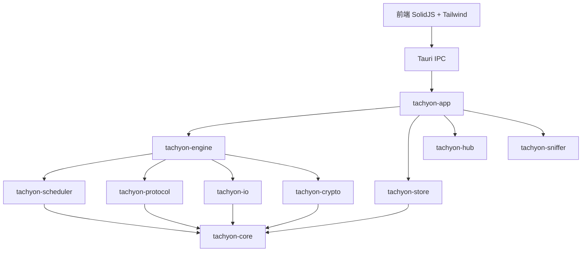

# Tachyon

> High-performance Rust + Tauri v2 desktop download manager.  
> 基于 Rust + Tauri v2 构建的高性能桌面下载器。

[](https://github.com/baiye2941/Tachyon/actions/workflows/ci.yml)


[](LICENSE)


---

## 简介

Tachyon 是一款面向大文件、AI 模型仓库和浏览器资源的高性能桌面下载器。后端使用 Rust 编写，以 Cargo workspace 组织 10 个 crate；前端基于 Tauri v2 + SolidJS，UI 采用 TailwindCSS v4。

**它主要解决这些问题：**

- 大文件单线程下载带宽利用率低、断线后需从头重下。
- 现有下载工具缺乏 HuggingFace 模型仓库的原生集成。
- 桌面端缺少在 I/O 路径上针对 Linux/Windows 做零拷贝优化的下载工具。

**核心能力一览**

| 能力 | 说明 |
|------|------|
| 多线程分片下载 | `DownloadTask` 动态分片规划，`JoinSet` 并发执行 |
| 多协议传输 | HTTP/HTTPS、QUIC、BitTorrent 磁力链接 |
| 零拷贝存储引擎 | Linux io_uring、Windows IOCP / WinFile、TokioFile 自动回退 |
| 智能调度 | `AdaptiveDownloadScheduler` + `HoltLinearPredictor` 双指数平滑 |
| 流式哈希校验 | BLAKE3 / SHA-256 CPU 校验，GPU 校验预留 |
| 断点续传 | 任务快照持久化，支持分片级和字节级续传 |
| HuggingFace Hub 集成 | 模型浏览、LFS 解析、Token 管理、本地模型扫描 |
| 浏览器资源嗅探 | 基于扩展名识别视频 / 音频 / 文档 / 压缩包等资源 |
| 多源并发下载 | MirrorProtocol 多镜像源 least-in-flight 调度 + 质量加权选源 |
| 限速控制 | 无锁令牌桶，支持跨任务全局限速（进程内共享 RateLimiter） |

---

## 技术栈

### 前端

| 技术 | 版本 | 用途 |
|------|------|------|
| SolidJS | ^1.9.13 | 细粒度响应式 UI |
| Tauri API | ^2.11.0 | 前后端 IPC |
| TailwindCSS | ^4.3.1 | 原子化 CSS |
| Vite | ^8.1.0 | 构建工具 |
| Bun | 1.x | 包管理 |
| Vitest | ^4.1.9 | 单元测试 |
| Playwright | ^1.61.0 | E2E 测试 |
| Storybook | 10.4.6 | 组件开发 |
| solid-i18n | ^1.1.0 | 中 / 英国际化 |

### 后端（Rust workspace 10 crate）

| Crate | 职责 |
|------|------|
| `tachyon-core` | 类型、trait、错误体系、配置、安全校验 |
| `tachyon-engine` | 分片引擎、并发许可器、多源竞速、限速器 |
| `tachyon-scheduler` | 智能调度、带宽预测、优先级队列 |
| `tachyon-io` | 跨平台异步 I/O（io_uring/IOCP）、BufferPool 池化、直接 async write |
| `tachyon-protocol` | HTTP/HTTPS、QUIC、BitTorrent 协议实现 |
| `tachyon-crypto` | BLAKE3 / SHA-256 校验、GPU 加速预留 |
| `tachyon-sniffer` | 浏览器资源类型识别与捕获过滤 |
| `tachyon-store` | 断点续传快照、文件系统 KV |
| `tachyon-hub` | HuggingFace Hub API 客户端 |
| `tachyon-app` | Tauri 应用入口、IPC 命令注册、生命周期管理 |

更多架构细节见 [docs/architecture.md](docs/architecture.md)。

---

## 安装

### 环境要求

| 依赖 | 最低版本 | 说明 |
|------|----------|------|
| Rust | 1.85 | 见 `rust-toolchain.toml` |
| Bun | 1.x | 前端包管理 |
| cargo-tauri | 2.x | Tauri CLI |

### 构建

```bash
git clone https://github.com/baiye2941/Tachyon.git
cd Tachyon

# 调试构建（默认 HTTP + magnet；QUIC/HTTP3 需显式 --features tachyon-protocol/http3）
cargo build

# 发布构建
cargo build --release

# 默认包含 HTTP + Magnet(根包未定义 feature 开关,如需仅 HTTP 请在 tachyon-protocol 层关闭)
cargo build
```

### 开发模式

```bash
# 前端开发服务器
cd frontend && bun install && bun run dev

# 同时启动前端 + Rust 后端
cargo tauri dev
```

---

## 用法

### GUI 快速开始

1. 启动应用：`cargo tauri dev` 或运行构建产物。
2. 在“新建任务”中粘贴下载链接，或从 HuggingFace Hub 浏览模型。
3. 选择保存路径，点击下载；任务列表实时显示速度、进度与分片状态。
4. 支持暂停、恢复、取消、删除；重启后会自动恢复未完成任务。

### HuggingFace 模型下载示例

在 HF 浏览器面板输入模型 ID（如 `bert-base-uncased`），选择分支与文件后批量创建下载任务。需要访问私有仓库时设置环境变量：

```bash
export HF_TOKEN=your_token_here
```

### 配置说明

核心配置位于 `tachyon-core::config`，前端对应 `frontend/src/types.ts`。常见项：

- `download_dir`：默认下载目录
- `max_concurrent_fragments`：单任务并发分片数
- `max_retries`：分片失败重试次数
- `rate_limit_bytes_per_sec`：全局限速
- `io_strategy`：I/O 后端策略

完整配置与 Feature 说明见 [docs/user-guide.md](docs/user-guide.md)。

---

## 系统架构

Tachyon 采用分层架构，依赖单向无环：



详细架构、流程图、模块说明见 [docs/architecture.md](docs/architecture.md)。

---

## 测试

```bash
# Rust 测试
cargo nextest run --all

# Clippy 零警告
cargo clippy --all-targets --all-features -- -D warnings

# 覆盖率（核心 crate）
cargo llvm-cov -p tachyon-core -p tachyon-engine -p tachyon-store \
  -p tachyon-io -p tachyon-crypto -p tachyon-scheduler \
  --fail-under-lines 90 --summary-only

# 前端测试
cd frontend && bun run test
```

完整 CI 说明见 [docs/architecture.md](docs/architecture.md#测试与-ci)。

---

## 贡献指南

1. Fork 并创建特性分支。
2. 代码标识符使用英文；注释、文档、提交信息使用中文。
3. 提交信息格式：`<类型>(<范围>): <简要描述>`。
4. 确保 `cargo clippy --all-targets --all-features -- -D warnings` 零警告。
5. 新功能需附带测试，核心 crate 覆盖率不低于 90%。
6. 所有 unsafe 代码必须有 Safety 注释。

更多细节见 [docs/user-guide.md](docs/user-guide.md)。

---

## 主要维护者

- [@baiye2941](https://github.com/baiye2941)

---

## 开源协议

本项目采用 MIT / Apache-2.0 双许可证。详见 [LICENSE](LICENSE)。
