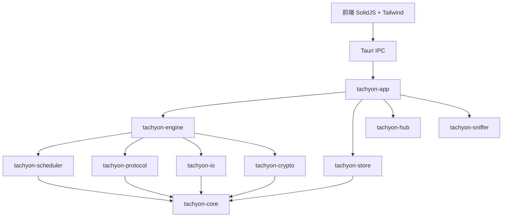

<div align="center">

# Tachyon

**基于 Rust + Tauri v2 的高性能桌面下载器**

[](https://github.com/baiye2941/Tachyon/actions/workflows/ci.yml?query=branch%3Amain+event%3Apush)
[](https://github.com/baiye2941/Tachyon/releases/latest)
[](https://github.com/baiye2941/Tachyon/actions/workflows/release.yml?query=event%3Apush)


[](LICENSE)


</div>

---

## 简介

Tachyon 是一款面向大文件、AI 模型仓库和浏览器资源的高性能桌面下载器。后端使用 Rust 编写，以 Cargo workspace 组织 10 个 crate；前端基于 Tauri v2 + SolidJS，UI 采用 TailwindCSS v4。当前版本 **v0.1.3**。

**它主要解决这些问题：**

- 大文件单线程下载带宽利用率低、断线后需从头重下。
- 现有下载工具缺乏 HuggingFace 模型仓库的原生集成。
- BT 下载在国内网络环境下需要走代理才能连通 tracker 与 peer。
- 桌面端缺少在 I/O 路径上针对 Linux / Windows 做系统级优化的下载工具。

**核心能力一览**

| 能力 | 说明 |
|------|------|
| 多线程分片下载 | `DownloadTask` 动态分片规划，`JoinSet` 并发执行 |
| 分片字节级实时进度 | 详情页分片矩阵实时显示每片字节级进度（约 250ms 聚合推送，快照式自愈） |
| 多协议传输 | HTTP/HTTPS、BitTorrent 磁力链接；QUIC/HTTP3 为编译期可选 feature |
| BT 代理支持 | SOCKS5 覆盖 tracker 与 peer；未显式配置时自动检测 `ALL_PROXY` / `HTTP_PROXY` |
| 高性能存储引擎 | Linux io_uring、Windows IOCP / WinFile、TokioFile 自动回退 |
| 智能调度 | `AdaptiveDownloadScheduler` + `HoltLinearPredictor` 双指数平滑 |
| 多源并发下载 | `MirrorProtocol` least-in-flight 调度 + 质量加权选源 |
| 断点续传 | 任务快照持久化，分片级与字节级续传，快照一致性校验防进度虚高 |
| 流式哈希校验 | BLAKE3 / SHA-256 CPU 流式校验（GPU 路径已移除） |
| 限速控制 | 无锁令牌桶，支持跨任务全局限速（进程内共享 `RateLimiter`） |
| HuggingFace Hub 集成 | 模型浏览、LFS 解析、Token 管理、本地模型扫描 |
| 浏览器资源嗅探 | 基于扩展名识别视频 / 音频 / 文档 / 压缩包等资源 |
| 任务控制 | 暂停 / 恢复 / 取消 / 删除；暂停走协作式控制通道，磁力下载注入 session coordinator |

---

## 技术栈

### 前端

| 技术 | 版本 | 用途 |
|------|------|------|
| SolidJS | ^1.9.13 | 细粒度响应式 UI |
| Tauri API | ^2.11.0 | 前后端 IPC |
| TailwindCSS | ^4.3.1 | 原子化 CSS |
| Vite | ^8.1.0 | 构建工具 |
| Bun | 1.x | 包管理与脚本运行 |
| Vitest | ^4.1.9 | 单元测试 |
| Playwright | ^1.61.0 | E2E 测试 |
| Storybook | 10.5.5 | 组件开发 |
| solid-i18n | ^1.1.0 | 中 / 英国际化 |

### 后端（Rust workspace 10 crate）

| Crate | 职责 |
|------|------|
| `tachyon-core` | 核心类型、trait、错误体系、配置、安全校验 |
| `tachyon-engine` | 分片引擎、连接管理、多源竞速、限速、任务执行 |
| `tachyon-scheduler` | 智能调度、带宽预测、优先级队列 |
| `tachyon-io` | 跨平台异步 I/O（io_uring / IOCP / WinFile）、`BufferPool` |
| `tachyon-protocol` | HTTP/HTTPS、BitTorrent（默认 magnet）、可选 HTTP3 |
| `tachyon-crypto` | BLAKE3 / SHA-256 CPU 流式哈希与完整性校验 |
| `tachyon-sniffer` | 浏览器资源类型识别与捕获过滤 |
| `tachyon-store` | 断点续传快照、文件系统 KV |
| `tachyon-hub` | HuggingFace Hub API 客户端（模型列表 / LFS / Token） |
| `tachyon-app` | Tauri 应用入口、IPC 命令、生命周期管理（bin: `tachyon`） |

更多架构细节见 [docs/architecture.md](docs/architecture.md)。

---

## 安装

### 预构建安装包（推荐）

从 [GitHub Releases](https://github.com/baiye2941/Tachyon/releases/latest) 下载最新版：

- **Windows**：`.msi` / setup.exe
- **macOS**：`.dmg`（当前发布 aarch64）
- **Linux**：`.deb` / `.rpm` / `.AppImage`

安装包附带 Tauri updater `.sig`、`.sha256` 与 cosign 校验材料。

### 从源码构建

| 依赖 | 最低 / 说明 |
|------|-------------|
| Rust | MSRV **1.85**（`Cargo.toml` `rust-version`）；`rust-toolchain.toml` 使用 `stable` + rustfmt/clippy |
| Bun | 1.x（`frontend/package.json` `packageManager`） |
| Tauri CLI | 2.x（`cargo tauri`） |

```bash
git clone https://github.com/baiye2941/Tachyon.git
cd Tachyon

# 调试构建（默认开启 HTTP + magnet）
cargo build

# 发布构建
cargo build --release

# QUIC/HTTP3（reqwest http3 为 unstable，需显式开启）
RUSTFLAGS='--cfg reqwest_unstable' cargo build --features tachyon-protocol/http3
```

### 开发模式

```bash
# 前端开发服务器
cd frontend && bun install && bun run dev

# 同时启动前端 + Rust 后端（Tauri）
cargo tauri dev
```

前端常用脚本：

```bash
cd frontend
bun run test          # Vitest
bun run test:e2e      # Playwright
bun run storybook     # Storybook :6006
bun run typecheck
bun run lint
```

---

## 用法

### GUI 快速开始

1. 启动应用：`cargo tauri dev` 或运行 Release 安装包。
2. 在「新建任务」中粘贴下载链接，或从 HuggingFace Hub 浏览模型。
3. 选择保存路径，点击下载；任务列表实时显示速度、进度与分片状态。
4. 打开任务详情页可查看分片矩阵：下载中分片显示字节级进度与百分比。
5. 支持暂停、恢复、取消、删除；重启后会自动恢复未完成任务。

### HuggingFace 模型下载

在 HF 浏览器面板输入模型 ID（如 `bert-base-uncased`），选择分支与文件后批量创建下载任务。访问私有仓库时设置：

```bash
export HF_TOKEN=your_token_here
```

### BT / 磁力链接

设置页「磁力链接」可配置 SOCKS5 代理（覆盖 tracker 与 peer）。留空时自动检测 `ALL_PROXY` / `HTTP_PROXY` 并转为 `socks5://`。

国内网络下 BT 通常需要 SOCKS5；仅配置 `HTTP_PROXY` 往往不够（UDP tracker / DHT / peer TCP 仍可能直连失败）。

### 配置说明

核心配置位于 `tachyon-core::config`，前端对应 `frontend/src/types.ts`。常见项：

- `download_dir`：默认下载目录
- `max_concurrent_fragments`：单任务并发分片数
- `max_retries`：分片失败重试次数
- `rate_limit_bytes_per_sec`：全局限速
- `io_strategy`：I/O 后端策略
- `magnet.socks_proxy_url`：BT SOCKS5 代理

完整配置与 Feature 说明见 [docs/user-guide.md](docs/user-guide.md)。

---

## 系统架构

Tachyon 采用分层架构，依赖单向无环：


```mermaid
graph TB
    FE["前端 SolidJS + Tailwind"] --> IPC["Tauri IPC"] --> APP["tachyon-app"]
    APP --> ENG["tachyon-engine"]
    ENG --> SCH["tachyon-scheduler"]
    ENG --> PROTO["tachyon-protocol"]
    ENG --> IO["tachyon-io"]
    ENG --> CRYPT["tachyon-crypto"]
    APP --> STORE["tachyon-store"]
    APP --> HUB["tachyon-hub"]
    APP --> SNIFF["tachyon-sniffer"]
    PROTO --> CORE["tachyon-core"]
    IO --> CORE
    CRYPT --> CORE
    STORE --> CORE
    SCH --> CORE
```

依赖层序（禁止跨层绕行）：

`tachyon-core` → `{tachyon-protocol, tachyon-io, tachyon-crypto, tachyon-scheduler}` → `tachyon-engine` → `tachyon-app`；`tachyon-hub` / `tachyon-sniffer` / `tachyon-store` 按各自 `Cargo.toml` 依赖。

详细架构见 [docs/architecture.md](docs/architecture.md)。

---

## 测试与质量

当前仓库约有：

- **Rust**：`#[test]` / `#[tokio::test]` 属性约 **2090+**（`crates/` 内统计）
- **前端**：约 **87** 个 Vitest 规格文件、约 **900+** 用例

CI 门禁覆盖构建 / 格式 / Clippy / 测试 / 覆盖率 / 审计 / 前端等；`test` job 跑 Windows / Linux / macOS，Clippy 与 MSRV 当前在 Linux + Windows。主 CI 关注正确性；变异测试（`Mutants`）为独立 workflow，不污染主 CI badge。

```bash
# Rust 测试（nextest，通常比 cargo test 更快）
cargo nextest run --all

# Clippy 零警告（CI 以 -D warnings 运行）
cargo clippy --all-targets --all-features -- -D warnings

# 覆盖率门禁（逐 crate + regions ≥ 90，与 CI 同源）
bash scripts/ci/coverage.sh

# 前端测试
cd frontend && bun run test
```

完整 CI 说明见 [docs/architecture.md](docs/architecture.md#测试与-ci)。

---

## 贡献指南

1. Fork 并创建特性分支。
2. 代码标识符使用英文；注释、文档、提交信息使用中文。
3. 提交信息格式：`<类型>(<范围>): <简要描述>`。
4. 确保 `cargo clippy --all-targets --all-features -- -D warnings` 零警告。
5. 新功能需附带测试，核心 crate 覆盖率不低于 90% regions。
6. 所有 `unsafe` 代码必须有 Safety 注释。

更多细节见 [docs/user-guide.md](docs/user-guide.md) 与 [AGENTS.md](AGENTS.md)。

---

## 主要维护者

- [@baiye2941](https://github.com/baiye2941)

---

## 开源协议

本项目采用 MIT / Apache-2.0 双许可证。详见 [LICENSE](LICENSE) 与 [LICENSE-APACHE](LICENSE-APACHE)。
