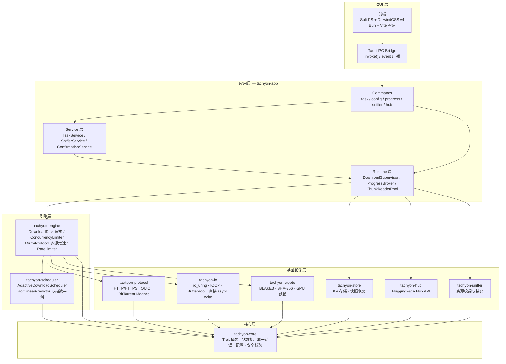
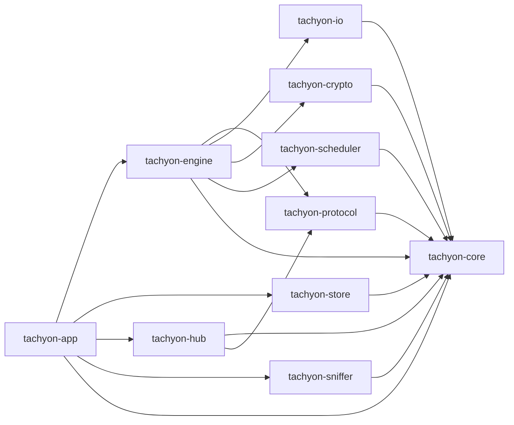
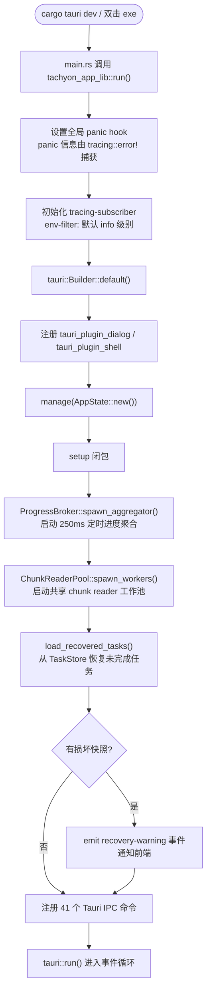
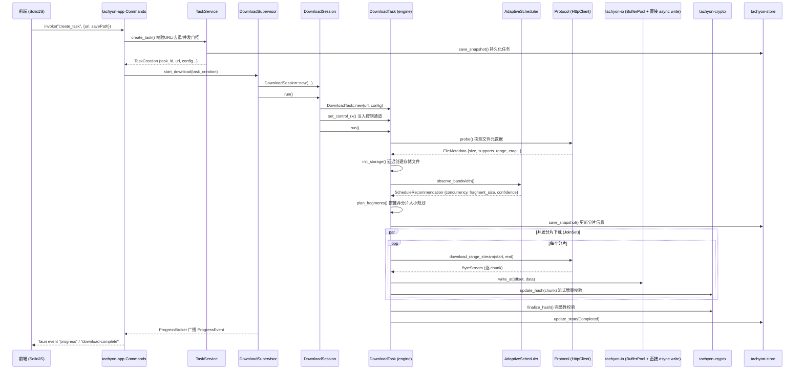
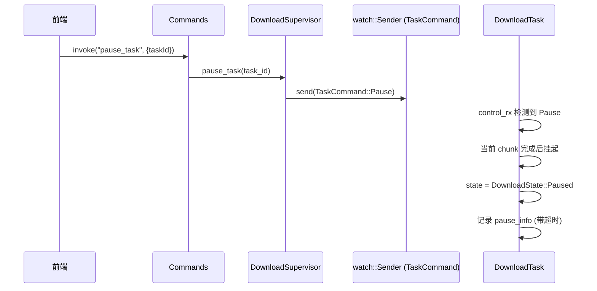
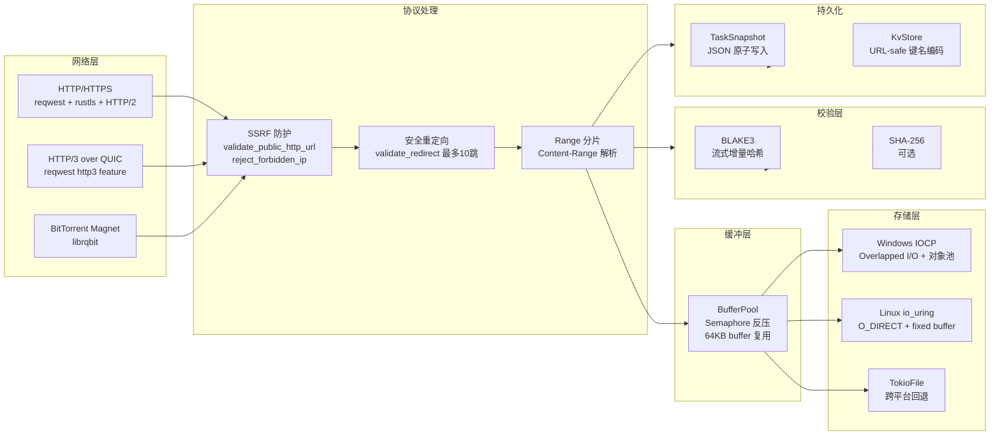
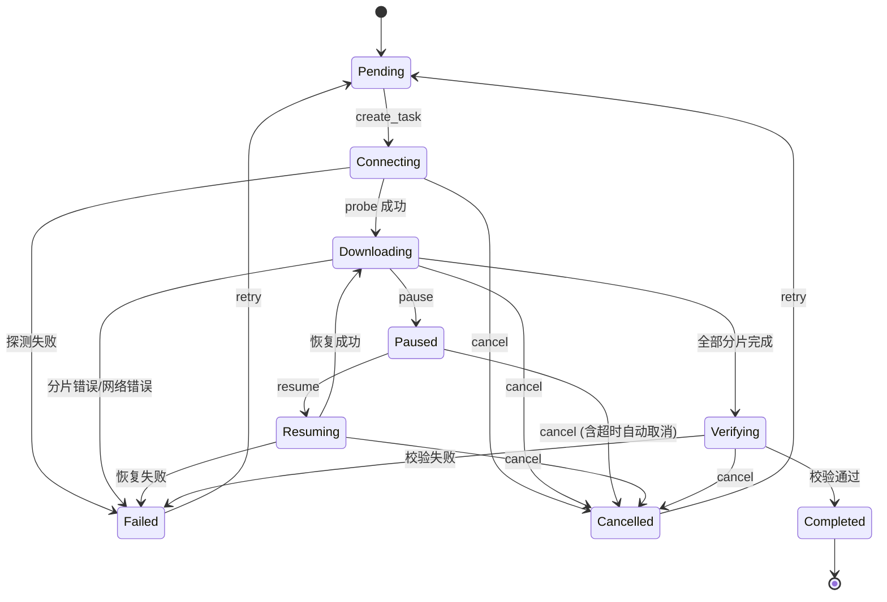

# Tachyon 架构与技术详解

本文档是 Tachyon 的完整技术参考，面向需要理解内部实现、进行二次开发或排查问题的读者。README 仅作为项目入口，深层内容均收录于此。

## 目录

- [1. 设计目标](#1-设计目标)
- [2. 系统分层](#2-系统分层)
- [3. Crate 职责与依赖](#3-crate-职责与依赖)
- [4. 核心模块详解](#4-核心模块详解)
- [5. 执行流程](#5-执行流程)
- [6. 数据流设计](#6-数据流设计)
- [7. 关键机制](#7-关键机制)
- [8. 性能与设计亮点](#8-性能与设计亮点)
- [9. 安全纵深防御](#9-安全纵深防御)
- [10. 测试与 CI](#10-测试与-ci)
- [11. 项目结构](#11-项目结构)

---

## 1. 设计目标

Tachyon 的设计围绕四个核心目标展开：

- **高吞吐**：充分利用多核 CPU 与多协议并行，提高带宽利用率。
- **低延迟**：减少 I/O 路径上的拷贝与系统调用，网络数据尽量直接落盘。
- **可恢复**：任务状态持久化，崩溃或断网后可从分片级/字节级断点继续下载。
- **可扩展**：协议、存储、校验、调度均通过 trait 抽象，新增后端只需实现约定接口。

---

## 2. 系统分层



依赖方向单向无环：`core -> {protocol, io, crypto, scheduler} -> engine -> app`，其余 crate 按各自 `Cargo.toml` 依赖执行，禁止跨层绕行。

---

## 3. Crate 职责与依赖

### 3.1 Crate 一览

| Crate | 职责 | 关键文件 |
|------|------|----------|
| `tachyon-core` | 所有 crate 共享的公共接口：类型、trait 抽象、错误体系、配置与安全校验 | `src/{config,error,traits,types,safety,utils}.rs` |
| `tachyon-engine` | 分片引擎、并发许可器、多源竞速、限速器、下载任务编排 | `src/{downloader,connection,fragment,mirror,circuit_breaker,rate_limit,storage_adapter}.rs` |
| `tachyon-scheduler` | 智能调度、带宽预测、优先级队列 | `src/{scheduler,predictor,download_scheduler}.rs` |
| `tachyon-io` | 跨平台异步文件 I/O，多后端自动选择 | `src/{iouring,iocp,winio,tokio_file,buffer,storage}.rs` |
| `tachyon-protocol` | HTTP/HTTPS/QUIC/BitTorrent Magnet 协议统一抽象 | `src/{http,magnet}.rs` |
| `tachyon-crypto` | CPU 哈希校验 + GPU 加速预留 | `src/{cpu,gpu}.rs` |
| `tachyon-sniffer` | 浏览器资源类型识别与过滤捕获 | `src/{capture,filter,resources}.rs` |
| `tachyon-store` | 断点续传快照持久化，基于文件系统 KV | `src/{kv,recovery,store}.rs` |
| `tachyon-hub` | HuggingFace Hub API 客户端 | `src/{api,classify,lfs,token}.rs` |
| `tachyon-app` | Tauri 桌面应用，注册 IPC 命令，管理生命周期 | `src/{lib,main,commands/,service/,runtime/,projection/,repository/,task_store}.rs` |

### 3.2 依赖关系图



### 3.3 关键第三方依赖

| 依赖 | 用途 |
|------|------|
| tokio | 异步运行时，多线程调度 |
| reqwest (rustls, stream, json, http2, 可选 http3) | HTTP 客户端，HTTP/2 支持；启用 `http3` feature 后经 Alt-Svc 协商升级 HTTP/3 |
| librqbit | BitTorrent 磁力链接下载 |
| blake3 / sha2 | 高性能哈希 |
| serde + serde_json + postcard | 序列化/反序列化 |
| thiserror | 错误类型派生 |
| tracing + tracing-subscriber | 结构化日志 |
| dashmap / parking_lot | 并发安全 HashMap 与轻量锁 |
| crossbeam-queue / crossbeam-utils | 无锁队列 |
| bytes | 字节缓冲区管理 |
| futures | 异步流处理 |
| mimalloc | 全局内存分配器 |

---

## 4. 核心模块详解

### 4.1 tachyon-core — 核心抽象层

**职责**：定义所有 crate 共享的类型、trait 抽象、错误体系、配置与安全校验。

**关键类型**：

| 符号 | 说明 |
|------|------|
| `DownloadState` | 9 状态枚举，含 `try_transition()` 状态机守卫 |
| `TaskCommand` | 控制命令枚举（Start / Pause / Resume / Cancel） |
| `PauseInfo` | 暂停超时跟踪，含 `is_expired()` 检测 |
| `FragmentInfo` | 分片信息（index / start / end / size / downloaded / hash） |
| `FileMetadata` | 远程文件元数据（name / size / content_type / range / etag） |
| `TaskProgress` | 任务进度聚合（downloaded / speed / progress / fragments_done） |
| `DownloadError` | 统一错误类型，含 Network / Protocol / Io / ChecksumMismatch 等变体 |
| `DownloadConfig` / `AppConfig` | 下载配置与应用根配置 |
| `IoStrategy` | I/O 后端枚举（Standard / WinAligned / Iocp / IoUring） |

**关键 trait** (`traits.rs`)：

| Trait | 说明 |
|-------|------|
| `Protocol` | 协议层抽象：`probe()` / `download_range()` / `download_range_stream()` / `download_full()` |
| `Storage` / `AsyncStorage` | 存储抽象：`write_at()` / `read_at()` / `sync()` / `allocate()` |
| `Verifier` | 校验抽象：`compute_hash()` / `verify()`，常量时间比较 |
| `TaskRunner` | 下载执行器抽象：`set_control_rx()` / `probe()` / `run()` / `metadata()` |
| `DownloadScheduler` | 调度器抽象：`observe_bandwidth()` / `recommend()` |

**安全校验** (`safety/`)：`sanitize_filename()`（O(n) 移除 `..`）、`validate_save_path()`、`validate_public_http_url()`、`reject_forbidden_ip()`、`validate_redirect()`、`redact_url_for_log()`。

### 4.2 tachyon-engine — 下载引擎层

**核心结构体 `DownloadTask`** (`downloader.rs`)：

```text
id: TaskId, url, config, protocol (Arc<dyn Protocol>),
storage (延迟初始化), scheduler (Arc<dyn DownloadScheduler>),
pool (Arc<ConnectionPool>), control_rx (watch::Receiver<TaskCommand>),
state (DownloadState), metadata (Option<FileMetadata>),
fragments (Vec<FragmentRecord>), progress_tx, verifier,
completed_fragments, partial_fragments (字节级断点续传),
rate_limiter, metrics, circuit_breakers
```

**`run()` 五阶段**：

1. `probe()` — 探测文件元数据；仅 `observe_rtt(probe_elapsed)`，**不**在 probe 阶段采样带宽。
2. `plan_fragments()` — 规划分片。**审计 P-03**:每任务新建冷启动 `AdaptiveDownloadScheduler`，plan 时刻 `confidence≈0`，故 `recommendation.fragment_size` 生产路径不可达；HTTP 首下回退 `default_target_fragments` 配置式分片。这是**有意设计**：固定分片边界保证续传 `completed_fragments ⊆ completed_indices`。execute 期 re-recommend 只调并发度，不改已落盘分片边界。
3. `init_storage()` — 配合 `validate_save_path()` 创建存储文件。
4. `execute()` — `JoinSet` 并发下载全部分片，每分片内流式写入 + 增量校验；完成后 `observe_bandwidth` 供后续 re-recommend。
5. `verify()` — 完整性校验。

**其他模块**：

| 模块 | 说明 |
|------|------|
| `ConnectionPool` | 全局**并发许可器**（非 TCP 池），`Semaphore` 按 host/全局限并发请求；真连接池在 reqwest Client |
| `MirrorProtocol` | 多镜像源适配器，主源失败自动 fallback |
| `FragmentRecord` | 分片记录，含 `FragmentState` 状态机和 `BandwidthTracker` |
| `RateLimiter` | 无锁令牌桶限速器，支持多任务共享 |
| `SourceCircuitBreakers` | 每源熔断器，持续失败 5 次后熔断 30s |
| `DynStorage` | 类型擦除存储包装器，衔接 Storage trait 与分片进度消息 |
| `BtSession` (magnet feature) | BitTorrent 磁力链接会话管理 |

### 4.3 tachyon-scheduler — 智能调度层

| 符号 | 说明 |
|------|------|
| `AdaptiveDownloadScheduler` | 实现 `DownloadScheduler` trait，周期性采样带宽 |
| `HoltLinearPredictor` | 双指数平滑带宽预测器，alpha=0.3 / beta=0.1，自动过滤异常值 |
| `ScheduledTask` + `Priority` | 优先级队列（Prefetch < Queue < UserInitiated） |

### 4.4 tachyon-io — 零拷贝存储引擎

| 后端 | 平台 | 关键技术 |
|------|------|----------|
| `IoUringStorage` | Linux 5.4+ | O_DIRECT + fixed buffer + 零拷贝读写管线 |
| `IoCpStorage` | Windows | Overlapped I/O + 完成端口 + 对象池复用 |
| `WinFile` | Windows | NO_BUFFERING + SEQUENTIAL_SCAN 优化 |
| `TokioFile` | 全平台 | tokio::fs 标准异步 I/O（回退） |

**缓冲管理**：

| 组件 | 说明 |
|------|------|
| `BufferPool` | 64KB buffer 池，`Semaphore` 反压，`BufferGuard` RAII 自动归还 |
| `AsyncStorage` | 统一 Storage trait 实现，封装平台差异 |

### 4.5 tachyon-protocol — 协议层

| 实现 | 依赖 | Feature Gate |
|------|------|--------------|
| `HttpClient` | reqwest（rustls + HTTP/2，可选 HTTP/3） | 始终启用；HTTP/3 需 `http3` feature |
| `MagnetProtocol` | librqbit | `magnet` |

所有实现均支持 `download_range_stream()` 流式下载，逐块产出数据。

`MagnetProtocol` 的 range 化：基于 librqbit 的 `FileStream`（`AsyncSeek` + `AsyncRead`），
`probe()` 对单文件 torrent 返回 `supports_range: true`，使磁力链接进入引擎的
`execute_fragmented_download` 多 worker 分片并发路径。每次 `download_range_stream` 新建
独立 `FileStream`（独立 `stream_id`），引擎多 worker 各持独立 stream 并发读不同字节区间，
librqbit 内部 `TorrentStreams::iter_next_pieces` 交错调度这些区间覆盖的 piece 请求，
实现"引擎分片并发 + BT 多 peer swarming 叠加"，消除原先 `wait_until_completed` 两段式阻塞。
多文件 torrent 仍回退 `download_full_stream` 两段式（按 file_id 调度留作后续扩展）。

### 4.6 tachyon-crypto — 校验层

| 实现 | 说明 |
|------|------|
| `CpuVerifier` | BLAKE3（默认）或 SHA-256，流式增量哈希 |
| `GpuVerifier` | 基于 wgpu 的 GPU 哈希（`gpu` feature，当前为空壳实现） |

安全特性：`Verifier::verify()` 使用常量时间字符串比较，防止时序侧信道。

### 4.7 tachyon-hub — HuggingFace Hub 集成

| 组件 | 说明 |
|------|------|
| `HubApi` / `HubClient` | 文件列表查询、LFS 解析、下载 URL 获取 |
| `HfFile` / `HfLfsInfo` / `HfModelInfo` | 文件与模型信息类型 |
| `classify` | 文件分类（模型权重、配置、分词器等） |
| Token 管理 | 从环境变量 `HF_TOKEN` 读取，Debug 时自动脱敏 |

Tauri 层暴露的 HF 命令包括：浏览仓库文件、获取下载 URL、获取模型信息、搜索模型、扫描本地模型、校验模型、收藏管理、批量创建下载任务。

### 4.8 tachyon-sniffer — 资源嗅探

- `identify_resource()`：基于扩展名识别 `ResourceType`（Video / Audio / Document / Archive / Executable / Image / Model / Other）。
- `should_capture()`：按类型启用 + URL 过滤器决定是否捕获。
- `ResourceManager`：嗅探资源管理，敏感参数脱敏。

### 4.9 tachyon-store — 持久化存储

| 组件 | 说明 |
|------|------|
| `Store` trait + `FileStore` / `MemoryStore` | 存储抽象与实现 |
| `KvStore` | 文件系统 KV，URL-safe Base64 键名编码 |
| `RecoveryManager` | 任务快照恢复，过滤已完成/已取消任务 |
| `TaskSnapshot` / `TaskRecord` | 快照数据结构 |

### 4.10 tachyon-app - Tauri 应用入口

> **分层（A-01 已收敛）**：`tachyon-app` 不再直接依赖 `tachyon-io` / `tachyon-scheduler` / `tachyon-crypto`。`BufferPool`、`create_adaptive_scheduler`、`sha256_file` 等由 `tachyon-engine` 门面再导出；app 只依赖 core/engine/hub/sniffer/store。

**注册的 Tauri IPC 命令**（当前 41 个）：

| 分类 | 命令 |
|------|------|
| 应用信息 | `get_app_info`, `supported_protocols` |
| 确认令牌 | `request_confirmation` |
| 任务管理 | `create_task`, `probe_filename`, `pause_task`, `resume_task`, `cancel_task`, `delete_task`, `get_task_list`, `get_task_detail` |
| 进度查询 | `get_download_progress`, `subscribe_progress` |
| 嗅探 | `get_sniffer_resources`, `add_sniffer_filter` |
| 配置管理 | `get_config`, `update_config` |
| HF Hub | `list_repo_files`, `get_hf_download_url`, `get_model_info`, `search_models`, `scan_local_models`, `verify_model`, `list_model_favorites`, `add_model_favorite`, `remove_model_favorite`, `batch_create_hf_tasks` |

**tachyon-app 内部三层架构**：

```text
+--------------------------------------------------+
|  Tauri Commands（适配层）                          |
|  参数解析 · 错误序列化 · IPC 桥接                    |
+--------------------------------------------------+
|  Service 层（业务逻辑）                             |
|  TaskService / SnifferService / ConfirmationService |
+--------------------------------------------------+
|  Runtime 层（运行时管理）                           |
|  DownloadSupervisor / ProgressBroker / ChunkReaderPool |
+--------------------------------------------------+
```

**AppState** 由四个独立状态组聚合：`DomainState`、`InfraState`、`ServiceState`、`RuntimeState`。

**前端源码结构** (`frontend/src/`)：

| 目录 | 说明 |
|------|------|
| `components/` | 30+ 组件（TaskList、DetailPanel、HfBrowserPanel、SnifferPanel 等） |
| `stores/` | 状态管理（downloads、hub、model、history、settings 等） |
| `hooks/` | 自定义 hooks（useAppInit、useGlobalKeyboard、useTheme 等） |
| `commands/` | 快捷键与命令注册 |
| `api/` | Tauri invoke / event 封装 |
| `utils/` | 工具函数（URL 校验、HF 镜像、模型元数据等） |
| `i18n/` | 中 / 英双语 |

---

## 5. 执行流程

### 5.1 启动流程



### 5.2 下载任务核心流程



### 5.3 控制命令流程



---

## 6. 数据流设计

### 6.1 网络到磁盘数据流



> **SEC-007 代理信任边界**:直连路径由 `PublicDnsResolver`/`reject_forbidden_ip` 过滤私网目标;启用 HTTP/SOCKS 代理后,目标域名解析与可达 IP 由代理决定,本地过滤器不覆盖代理后端。仅使用可信代理。

### 6.2 下载任务状态机



`DownloadState::try_transition()` 强制执行合法状态转换。`PauseInfo` 跟踪暂停时长，超时自动触发取消。

### 6.3 ProgressBroker 事件聚合

`ProgressBroker` 以单一 250ms 定时器扫描所有活跃任务，合并为单个 `ProgressEvent`（HashMap）广播：

```text
活跃任务 100 个时:
  旧方案 (每任务独立 500ms monitor): ~200 events/s
  ProgressBroker (单一定时器):    4 events/s
  降低约 98% 的 IPC / JSON 序列化 / 前端 store 更新开销
```

---

## 7. 关键机制

### 7.1 ConnectionPool（并发许可器）

- **诚实命名（A-02）**：历史类型名 `ConnectionPool`，语义实为 `ConcurrencyLimiter`（`pub type ConcurrencyLimiter = ConnectionPool`）。
- **不持有 TCP 连接**。TCP/TLS/H2 连接复用由 reqwest `Client` 与进程级 `HttpClientRegistry` 负责。
- 两级 `Semaphore`：`max_per_host` 限制单 host **并发请求许可**，`max_global` 限制全局并发。
- 指标：`active_requests()` / `host_active_requests()`（历史别名 `active_connections` 仍可用，但表示许可占用而非 socket 数）。
- 使用 `DashMap` 维护 host 级信号量索引，降低高并发下的锁竞争。
- 关闭时返回错误而非 panic。
- **审计 E-06**:本类型**无**主动健康探测 API——它不是 socket 池。死连接由 reqwest `pool_idle_timeout` + TCP keepalive + H2 PING（`http2_keep_alive_*`）在首次 I/O 或空闲超时发现并淘汰；在 `ConnectionPool` 上加 probe 是类别错配。

### 7.2 RateLimiter

- 无锁令牌桶，支持跨任务共享全局限速（`InfraState.global_rate_limiter` 注入所有任务）。
- 每个分片在写入前尝试获取令牌，不足时异步等待。

### 7.3 SourceCircuitBreakers

- 每源独立计数，持续失败 5 次后熔断 30s。
- 熔断期间 `MirrorProtocol` 自动 fallback 到备用源。

### 7.4 BufferPool

- 默认 64KB buffer，`Semaphore` 控制总 buffer 数量。
- `BufferGuard` RAII 自动归还，避免泄漏。
- 许可耗尽时 `alloc()` 阻塞，形成背压。

### 7.5 HoltLinearPredictor

- 双指数平滑（alpha=0.3，beta=0.1）。
- Level 分量跟踪当前带宽，Trend 分量捕捉趋势。
- 自动过滤 NaN / Inf / 负值。

### 7.6 Verifier

- CPU 路径支持 BLAKE3 与 SHA-256。
- 流式增量哈希，边下载边计算。
- `verify()` 使用常量时间比较，防止时序侧信道。

---

## 8. 性能与设计亮点

### 8.1 并发模型

- tokio multi-thread runtime，充分利用多核。
- `JoinSet` 并发分片，失败隔离。
- `Semaphore` 门控连接、buffer 数量。
- `watch` 通道控制暂停/恢复/取消，开销极低。
- `ChunkReaderPool` 固定 worker 数，避免 task 数量随任务数线性增长。

### 8.2 零拷贝 I/O

- **Linux io_uring**：O_DIRECT 绕过页缓存，fixed buffer 避免每 I/O 分配，SQE/CQE 批量提交。
- **Windows IOCP**：无锁完成端口 + NO_BUFFERING 写入，OVERLAPPED 对象池复用。
- **直接 async write**：下载主路径经 `BufferPool` 池化后直接 `storage.write_at`，反压由 buffer 许可承担。

### 8.3 调度与预测

`AdaptiveDownloadScheduler` 根据预测带宽和文件大小计算最优 `fragment_size` 与 `concurrency`，置信度评估帮助判断决策可靠性。**审计 P-03**:plan 时刻冷启动 confidence≈0，生产分片大小由 `default_target_fragments` 配置式确定；execute 期 re-recommend 只调并发（见 §4.2）。

**审计 P-04 / DHT**:已用 librqbit 9.0.0-rc.0；`MagnetConfig.dht_bootstrap_addrs` → `DhtSessionConfig.bootstrap_addrs`，`peer_limit` 透传。空 bootstrap 仍走上游默认 2 节点。Session 映射见 `bt_session::build_session_options`。

**审计 E-05 测试金字塔**:单元测试为主；跨层集成支柱为 `crates/tachyon-engine/tests/chaos_test.rs`（真实 `DownloadTask::run` + 故障注入）、`crates/tachyon-app/tests/panic_log_e2e.rs`、以及 `e2e_download`/`e2e_http_real` bench。扩展时优先垂直切片，而非仅堆单元数。

### 8.4 事件聚合

`ProgressBroker` 单一定时器 250ms 扫描，100 活跃任务下事件从 ~200/s 降至 4/s。

---

## 9. 安全纵深防御

| 层次 | 措施 |
|------|------|
| URL 校验 | `validate_public_http_url()` 拒绝内网 / 本地地址 |
| DNS 重绑定防护 | `validate_resolved_ip()` 解析后再次校验 |
| 重定向安全 | `validate_redirect()` 每跳校验，最多 10 跳 |
| 路径遍历防护 | `sanitize_filename()` O(n) 移除 `..`；`validate_save_path()` 强制 canonical_parent + file_name |
| 授权目录白名单 | `authorized_dirs` 限制写入范围 |
| 常量时间哈希比较 | 防时序侧信道 |
| 确认令牌 | `ConfirmationStore` 一次性 UUID token，60s 过期，容量上限 1024 |

---

## 10. 测试与 CI

### 10.1 测试命令

```bash
# 全部测试
cargo nextest run --all

# 单 crate
cargo nextest run -p tachyon-core

# clippy 零警告
cargo clippy --all-targets --all-features -- -D warnings

# 格式检查
cargo fmt --all -- --check

# 覆盖率门禁（逐 crate + --fail-under-regions 90，与 CI 同源）
bash scripts/ci/coverage.sh

# 前端测试
cd frontend && bun run test

# 本地 CI 预检
cargo fmt --all -- --check && \
  cargo clippy --all-targets --all-features -- -D warnings && \
  cargo nextest run --all && \
  cargo deny check && cargo audit && cargo machete && taplo check && \
  RUSTDOCFLAGS="-D warnings" cargo doc --no-deps --all-features
```

### 10.2 CI 作业

| Job | 说明 |
|-----|------|
| fmt | `cargo fmt --check` |
| clippy | `cargo clippy -D warnings`（当前 Ubuntu） |
| test | Ubuntu / Windows / macOS 三平台矩阵 |
| docs | `cargo doc --no-deps` 零警告 |
| audit | `cargo deny check` + `cargo machete` |
| cargo-audit | `cargo audit` |
| taplo | TOML 格式检查 |
| coverage | 逐 crate `cargo llvm-cov --fail-under-regions 90`（`scripts/ci/coverage.sh`） |
| miri | Miri unsafe 代码检测 |
| msrv | MSRV 工具链兼容性检查 |
| doc-drift | 文档/计数漂移门禁 |
| bench | Criterion 基准 Smoke 测试 |
| frontend | TS 类型检查 + lint + test + 构建 |

---

## 11. 项目结构

```
Tachyon/
├── Cargo.toml                  # workspace 根配置
├── Cargo.lock
├── LICENSE
├── README.md                   # 项目入口（轻量）
├── deny.toml                   # cargo-deny 策略
├── rust-toolchain.toml
├── docs/                       # 项目核心文档（随仓库提交）
│   ├── architecture.md         # 架构与技术详解
│   └── user-guide.md           # 使用指南、配置、已知限制
├── Document/                   # 其他本地文档（.gitignore 忽略）
│   ├── aegis/                  # 基线与 ADR
│   ├── Front/                  # 前端实验/参考实现
│   ├── Front_design/           # 前端迭代设计稿
│   ├── ITERATION/              # 迭代报告
│   ├── superpowers/            # 计划与规格
│   └── ...
├── crates/                     # Rust workspace 10 crate
│   ├── tachyon-core/
│   ├── tachyon-engine/
│   ├── tachyon-scheduler/
│   ├── tachyon-io/
│   ├── tachyon-protocol/
│   ├── tachyon-crypto/
│   ├── tachyon-sniffer/
│   ├── tachyon-store/
│   ├── tachyon-hub/
│   └── tachyon-app/
├── frontend/                   # SolidJS + TailwindCSS v4 前端
├── benches/                    # Criterion 基准测试
├── tests/                      # 集成测试
└── fuzz/                       # 模糊测试
```
